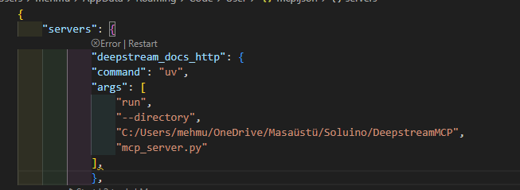

# DeepstreamMCP

uv sync

uv pip install torch torchvision torchaudio --index-url https://download.pytorch.org/whl/cu128

uv pip install sentence_transformers

uv run python download_docs.py 

uv run python html2txt.py

uv run python vectorize_docs.py 

uv run client.py mcp_server.py

uv run python gemini_chatbot.py mcp_server.py

```
"deepstream_docs_http": {
    "command": "uv",
    "args": [
        "run",
        "--directory",
        "<where you cloned the repository>",
        "mcp_server.py"
    ]}
```
